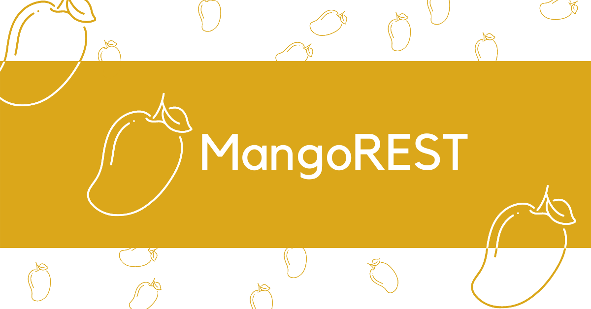

<p align="center"><em>Serve a RESTful API from any MongoDB database.</em></p>

<p align="center"><strong>WORK IN PROGRESS</strong></p>


## Overview

MangoREST aims to speed up serving RESTful APIs for CRUD apps utilizing MongoDB. It is built with Flask and pymongo, and is designed to simplify setting up the backend as much as possible but also giving room for extensibility.

Inspired by the giants [RESTHEART](https://restheart.org/) (written in Java), and [PostgREST](https://postgrest.org/en/v8.0/index.html) (written in Haskell).

## Get Started

There is no hard-ruled step-by-step guide on how to get MangoREST up and running since it actually depends on the deployment strategy. Read the [Installation and Deployment](#installation-and-deployment) section for some deployment options. Remember that MangoREST is just a Flask app.

There are specific things that must be done though to start using MangoREST. One, is to provide configuration (see [Configuration](#configuration) section for the config parameters). Also, the MangoREST *user collection* and at least one superuser must be created (see [Authentication](#authentication) section).

## Configuration

MangoREST configuration is set using environment variables to determine the database information and ways on how to serve REST client requests. Reading from a `.env` file is supported. Here is the complete list of configuration parameters:

#### FLASK_ENV

Optional. Sets the context to where Flask is running in. Setting to `development` will enable debug mode. Flask **default** setting is `production`.

Reference: https://flask.palletsprojects.com/en/2.0.x/config/#environment-and-debug-features

#### FLASK_APP

Required. Used to specify how to load the application. **Must** be set to `mangorest:app`. Please do change accordingly if customizing/extending MangoREST.

Reference: https://flask.palletsprojects.com/en/2.0.x/cli/

#### MONGODB_URI

Required. To be used by `pymongo.mongo_client.MongoClient`.

Reference(1): https://docs.mongodb.com/manual/reference/connection-string/

Reference(2): https://pymongo.readthedocs.io/en/stable/api/pymongo/mongo_client.html#pymongo.mongo_client.MongoClient

#### DATABASE

Required. Name of the database to be exposed to REST clients. MangoREST only allows a single database to be specified. The name itself will not be exposed.

#### COLLECTIONS

Required. A sequence of `resource_name:collection_name` pairs separated by commas. To avoid exposing the database's collection names, the `resource_name`s will be used for the API endpoints. Map a `resource_name` to the name of the collection that will be exposed to REST clients.

**If you don't care exposing ALL** collections and their collection names, you can use an asterisk wildcard `*`. The collection names themselves will be the `resource_name` to be used for the API endpoints.

Here is an example config taken from the `.env.example` file in this repo:

```bash
FLASK_ENV=production
FLASK_APP=mangorest:app
MONGODB_URI=mongodb://localhost:27017/
DATABASE=therocketcorpdb
COLLECTIONS=rockets:rocket_engines,vehicles:launch_vehicles
```

## Installation and Deployment

MangoREST is *just* a Flask app. Therefore, ways to deploy Flask also applies to deploying MangoREST. 

Reference: https://flask.palletsprojects.com/en/2.0.x/deploying/index.html

This section presents a few of the quick deployment options for MangoREST. 

### Deploy to Heroku with One-Click button

A quick and easy way to deploy and configure MangoREST as a [Heroku](https://www.heroku.com/) app.

[](https://heroku.com/deploy)

### Deploy to Render with One-Click button

A quick and easy way to deploy and configure MangoREST as a [Render](https://render.com/) app.

[](https://render.com/deploy)

### Install as a package + gunicorn

## Authentication

## API

### Querying

### Inserting or Updating

### Deleting

